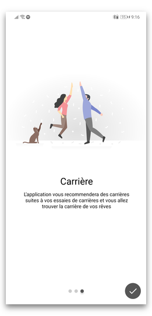
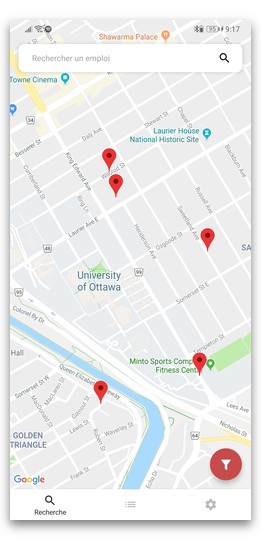
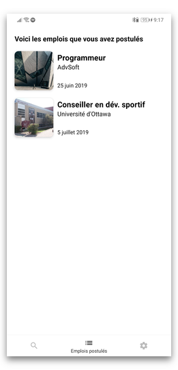
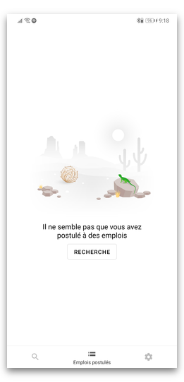
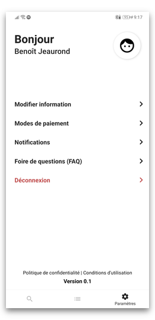
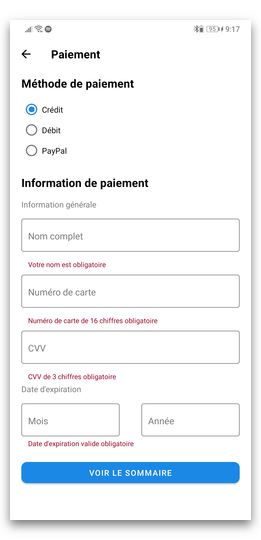

# ExploreCarrière

Explorer des carrières où vous pouvez visiter des équipes au sein d’organisations. Vous pouvez avoir pour but de simplement découvrir de nouvelles carrières en explorant les choix possibles, ou bien vouloir se renseigner au sujet d’une carrière spécifique.

## Équipe
* Benoît Jeaurond
* Zainab Al Showely
* Sidiki Keita

## Capture d'écrans
La maquette de l'application est disponible au lien https://xd.adobe.com/view/1c5eec2a-4ab2-4ebb-5447-358681147458-6a6f/

Voici les captures d'écrans de l'application

[](./screenshots/Welcome1.jpg)
[](./screenshots/Welcome2.jpg)
[](./screenshots/Login.jpg)
[](./screenshots/Signup.jpg)
[](./screenshots/Map.jpg)
[](./screenshots/AppliedJobs.jpg)
[](./screenshots/AppliedJobsEmpty.jpg)
[](./screenshots/Settings.jpg)
[](./screenshots/JobInfo.jpg)
[](./screenshots/Availabilities.jpg)
[](./screenshots/Payment.jpg)
[](./screenshots/Summary.jpg)

## Dépendances
Tous les dépendances de `React Native CLI`, les instructions sont disponibles [ici](https://facebook.github.io/react-native/docs/getting-started) sous l'onglet `React Native CLI Quickstart`.

Vous pouvez installer `Yarn` aussi pour faciliter le développement en suivant les instructions [ici](https://yarnpkg.com/en/docs/install). Ceci est une amélioration de npm et peut être utiliser en place de npm. Celui-ci est considérablement plus rapide et permet de simplifier plusieurs commandes npm.

## Structure de fichiers

Tout le code important pour nous se retrouve dans le dossier `src` et dans le fichier `index.js`. Le fichier `index.js` est responsable aussi pour la navigation.

### Structure du dossier `src`

* `src/components`
  * Contient tout les components utilisé entres écrans
  * `screens`
    * Contient les components des écrans
* `src/data`
  * Contient tout les fichier de données, tels que ceux JSON
* `src/redux`
  * Contient les documents associés à la gestion de la base de donnée du client
  * `actions`
    * Contient les actions que tu peux accomplir sur la base de donnée
  * `reducers`
    * Accomplie les opérations des actions sur la base de donnée
  * `store`
    * Contient la spécification de la base de donnée

## Notes

### Facilitation de développement
Pour plus facilement développer l'application, activer la fonction `Hot Reload` en secouant le cellulaire ou sur un émulateur en cliquant `ctrl+m` et sélectionner `Enable Hot Reload`.

Du même menu, tu peux débuger l'application en sélectionnant `Debug JS remotely` ce qui ouvrera une page web, puis pour voir ce qui ce passe, aller dans `Inspect Element` et sur l'onglet `Console` pour voir les modification à la base de données et vos `console.log`.

Si vous avez `Yarn` d'installé, vous pouvez taper `yarn android` et `yarn ios` respectivement pour démarrer l'application au lieu de faire `react-native run-android` ou `react-native run-ios`.

### Obtenir la grander des éléments

Pour obtenir la hauteur du _StatusBar_, importer
``` javascript
import { getStatusBarHeight } from 'react-native-iphone-x-helper';
```
puis appelle simplement la fonction `getStatusBarHeight()`. Cette fonction devrait être utiliser au lieu de celui de défault dans React Native, car il prend en compte plus de différente formes d'appareils.

Pour obtenir la hauteur du _Header_, importer
```javascript
import { Header } from 'react-navigation';
```
puis accède la constante `Header.HEIGHT`


## Modules React Native utilisé

### Documentation de modules
Tout les modules en bas son déjà installé et leur lien font référence à leurs documentation

<br>

Bottom Navigation
https://github.com/react-navigation/material-bottom-tabs

Welcome Intro Sliders
https://github.com/Jacse/react-native-app-intro-slider

Icons
https://github.com/oblador/react-native-vector-icons

Material Design Components
https://github.com/callstack/react-native-paper

Get appropriate status bar height
https://github.com/ptelad/react-native-iphone-x-helper

Linear Gradient
https://github.com/react-native-community/react-native-linear-gradient

Maps
https://github.com/react-native-community/react-native-maps
https://github.com/react-native-community/react-native-geolocation

Easy Modals/Popups
https://github.com/react-native-community/react-native-modal

Navigation
https://github.com/react-navigation/react-navigation

Touchable elements
https://github.com/react-native-community/react-native-platform-touchable

Client side database
https://github.com/reduxjs/redux
https://github.com/reduxjs/react-redux

Persists database
https://github.com/rt2zz/redux-persist

Database logger
https://github.com/LogRocket/redux-logger

Datetime picker
https://github.com/mmazzarolo/react-native-modal-datetime-picker

Touchable
https://github.com/react-native-community/react-native-platform-touchable

Storage
https://github.com/react-native-community/async-storage

## Images d'ambiance
https://icons8.com/ouch/style/fogg-5
